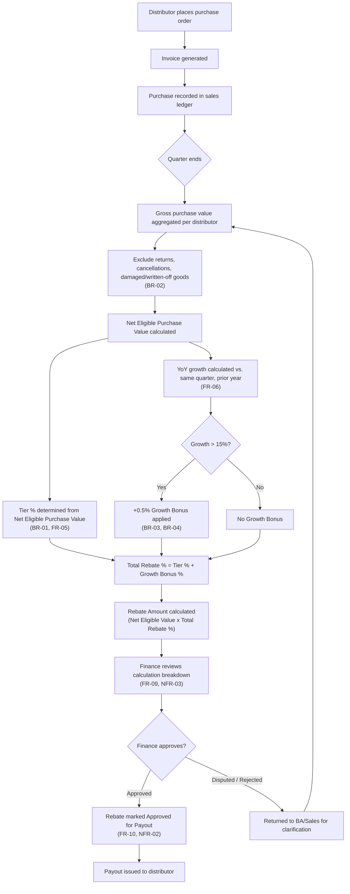

# Process Flow — Distributor Rebate Lifecycle
### Coastal Building Supplies Pvt. Ltd.

This diagram traces one distributor's purchase through the full rebate lifecycle — from the original transaction to the payout — reflecting the rules defined in `02-Business-Requirements-Document.md`.

It renders automatically as a diagram on GitHub (Mermaid is natively supported). If viewing outside GitHub, paste the code block into [mermaid.live](https://mermaid.live) or draw.io's Mermaid import.

## Reading the Flow

1. **Steps A–C** happen continuously throughout the quarter as normal sales activity.
2. **Steps D–G** are the exclusion logic — this is the step that directly fixes the manual-error problem raised in discovery (a human no longer manually subtracts returns).
3. **Steps H–M** run the tier lookup and growth bonus calculation in parallel, then combine them — matching FR-09's requirement that each component stay separately visible for audit.
4. **Steps O–Q** are the human control point: Finance must review and approve before anything is paid, per NFR-02. Nothing is auto-paid.
5. **Step R** is the exception path — if Finance disputes a number, it loops back to re-aggregate rather than being manually overridden, which protects NFR-01 (reproducibility).
